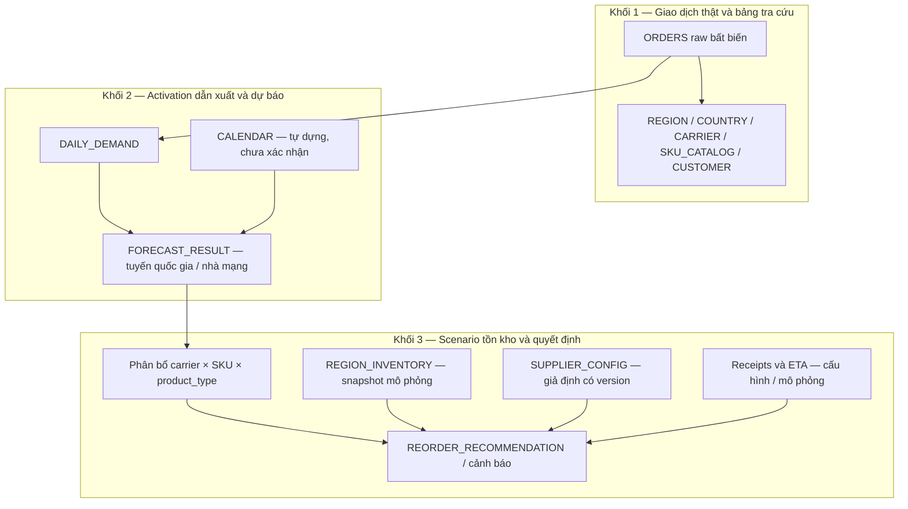

# Kiến trúc dự kiến

Mô hình logic giữ ba khối và tên các bảng gốc, cập nhật theo review và [phạm vi orders-only](PROJECT_OVERVIEW.md). Nhóm tự dựng đầu vào mô phỏng M3; không chờ inventory/config/receipt thật. Cấu trúc triển khai mới là **[MỀM]**; giá trị/default cụ thể vẫn **cần mentor xác nhận** cho nghiệm thu ở [DECISIONS](DECISIONS.md).

## Ba khối dữ liệu



Calendar do nhóm tự dựng; inventory/config không được cấp và sẽ là dữ liệu scenario. **[XÁC NHẬN]** Region điểm đến chưa chứng minh có kho vật lý; carrier chưa chắc là NCC ký hợp đồng. Kho logic/region và carrier=NCC là giả định demo, không phải phụ thuộc phải có xác nhận vận hành thật mới chạy được. Không dùng chung một stock cho nhiều carrier/type.

**[MỀM] Luồng dựng scenario:** khai báo stock đầu kỳ/config và receipts ban đầu nếu có; phát sinh receipt mới từ lượng đặt và lead time giả định; cập nhật snapshot theo nhận hàng và tiêu thụ mô phỏng. Ghi sự kiện trừ kho (activation/order/reservation) được chọn; không tự coi activation là sự kiện trừ kho thật. Lịch sử chỉ cung cấp tín hiệu replay, không xác định duy nhất stock/L/MOQ thật. Kho/config/receipts có nguồn giả định, quy tắc sinh, version, scenario_id và seed nếu sinh ngẫu nhiên; thiếu config vẫn trả trạng thái thiếu dữ liệu.

## Danh sách 12 bảng và sửa đổi khóa/cấu trúc

| Bảng | Khóa/phạm vi thiết kế | Điều chỉnh từ B4 |
|---|---|---|
| ORDERS | order_id | Giữ raw bất biến; order_date và activation_date suy ra UTC riêng. Nếu giữ đồng thời carrier/country/region, kiểm tra bộ ba khi nạp; FK riêng lẻ không đủ. Khoảng quantity quan sát trong [contract](DATA_CONTRACT.md) không phải giới hạn nghiệp vụ vĩnh viễn |
| REGION | region_code | Chiều phân tích; kho/pool logic là giả định mô phỏng, không tuyên bố có kho vật lý tương ứng |
| COUNTRY | country_name | Country 1–n Carrier, Region 1–n Country. Có thể cho destination dạng nhóm nếu nghiệp vụ cần; không coi các nước cùng region là tương đương |
| CARRIER | carrier_id | Kiểm tra mapping tên carrier gốc. region_code dư thừa so với country: giữ có đối soát hoặc bỏ; mapping carrier=NCC chưa xác nhận |
| SKU_CATALOG | sku | Thuộc tính cố định; SKU chung chưa đủ nhận diện offering thay thế. data_gb unlimited cần data dictionary, không tự coi là hard cap |
| CUSTOMER | customer_id | Tùy nhu cầu tra cứu; không cần trên đường chạy forecast M2, không dùng tổng hợp toàn kỳ làm feature; giữ phạm vi loại trừ của [contract](DATA_CONTRACT.md) |
| CALENDAR | date | Phủ cả train và ngày forecast; lưu nguồn/phiên bản được duyệt, tạo ngày tương lai còn thiếu trước inference |
| DAILY_DEMAND | **[MỀM]** target_version + date + series_key | series_key biểu diễn route country/carrier và SKU nếu tách. Metadata khai báo grain, event_date_basis, filter, cửa sổ quan sát/cutoff. Nhánh order-date × Region × SKU v0.1 tách bằng version; không tái dùng đối soát cũ cho activation |
| REGION_INVENTORY | Snapshot + region + carrier + SKU + product_type, hoặc stock_item_id biểu diễn đủ các chiều | **[CỨNG]** Bổ sung carrier/type vào khóa cũ. Lưu snapshot timestamp, source, scenario; định nghĩa usable stock, reserved và hàng không bán được |
| SUPPLIER_CONFIG | Thiết kế versioned theo carrier/type, scope SKU và effective_from | Khóa carrier+SKU cũ không đủ cho nhiều phiên bản/product_type. **[MỀM]** Có thể dùng config_id, scope, SKU nullable với uniqueness/hiệu lực rõ, hoặc tách default/override. `sku='*'` không phải SKU thật, không ép qua FK SKU_CATALOG; xác định thứ tự override |
| FORECAST_RESULT | **[MỀM]** run_id + series_key + forecast_date | Mỗi run gắn một target/grain version; series_key giải ra country/carrier và chiều con nếu có. Metadata lưu model_version/data_cutoff/filter. **[CỨNG]** run_date không phân biệt rerun; khóa phải thống nhất, không ghi forecast activation vào chuỗi order-date |
| REORDER_RECOMMENDATION | Định danh khuyến nghị và stock item đủ region/carrier/SKU/type | **[CỨNG]** Bổ sung carrier/type; liên kết run forecast, snapshot, config version, allocation version, rule version, scenario. Khuyến nghị dùng tổng nhiều forecast_date, không FK đơn giản tới một dòng forecast ngày |

**[MỀM]** Có thể bổ sung `OPEN_RECEIPTS` nhỏ cho lượng đã đặt, ETA và trạng thái; đây là phần hỗ trợ đề xuất, không đổi tên danh sách 12 bảng gốc thành hệ thống đã triển khai. Tổng in_transit_qty không đủ xác định hàng về trước/sau ngày cạn. Không có ETA thì “chưa đủ dữ liệu”, không xem hàng đang về là có sẵn ngay.

## Phân bổ forecast xuống stock item

**[MỀM] Cập nhật cho activation/tuyến:** nếu dự báo tổng route, phân bổ xuống SKU/product_type trong cùng route bằng lịch sử cùng target tại origin. Nếu đã dự báo route × SKU/type thì tổng hợp lên route để chấm KPI và dùng cấp con tương ứng cho policy. Phương án kỹ thuật này cần kiểm thử, chưa có kết quả mới. Region × SKU → carrier/type ở B5 chỉ còn dùng cho nhánh v0.1 hoặc thử mô hình gộp có kiểm chứng.

**[MỀM]** Baseline là tỷ trọng quantity 30 ngày, fallback 90 ngày; cần đo ở cấp nhận phân bổ, không chỉ ở chuỗi cha. Cửa sổ này là đề xuất cần xác nhận/thử nghiệm, không phải quy tắc doanh nghiệp đã chốt.

**[CỨNG]** Các điều kiện của B5:

1. Chỉ dùng lịch sử tới origin; mẫu số cùng parent/target/cửa sổ. Parent là route cho nhánh activation mới, region/SKU cho v0.1. Không dùng share order-date như share activation mà không ghi là giả định và kiểm thử.
2. Lọc offering hợp lệ; phân biệt chưa có lịch sử với không còn cung cấp. Nếu cả hai cửa sổ không có quantity, xuất `allocation_unavailable` hoặc mapping demo đã cấu hình, không chia cho 0.
3. Tổng share bằng 1 chỉ khi toàn bộ nhu cầu cha còn được phục vụ. EOL làm mất khách thì tách nhu cầu giữ được và không phục vụ được, không ép chuyển toàn bộ sang carrier còn lại.
4. Compatibility phải xét điểm đến, thiết bị, gói/quyền sử dụng và nguồn cung. Cùng region không cho phép tự thay country; không tự đổi eSIM sang physical_SIM.
5. Giữ forecast số thực; chỉ làm tròn khi tạo lượng nhập. Nếu cần phân bổ số nguyên giữ tổng, dùng quy tắc phân phối phần dư thống nhất.
6. Sai số share góp vào bất định cấp con; quantile cha nhân share không tự trở thành quantile đúng của từng con.

## Safety Stock, ROP và periodic review

**[CỨNG]** PDF có hai công thức lượng nhập chưa thống nhất kỳ bảo vệ. Không chọn công thức bằng cảm tính hoặc trộn trigger của policy này với target của policy khác.

**[MỀM]** Tách ba đại lượng:

- `L`: thời gian từ đặt mua tới hàng sẵn sàng sử dụng, cùng đơn vị ngày với forecast; không dùng activation lag để điền L.
- `R`: chu kỳ xem xét/đặt mua.
- `IP`: on-hand khả dụng + đơn đang về được công nhận − nghĩa vụ chưa đáp ứng. Nếu usable stock đã trừ reservation thì không trừ lần hai; tránh trùng reservation/backorder.

**[MỀM] / [XÁC NHẬN]** Default periodic review: mỗi R ngày đặt bổ sung lên S bảo vệ L+R ngày. L, R, service target, MOQ, manual ROP và policy cần mentor xác nhận ở câu 4; công thức sau là thiết kế đề xuất từ B6.2:

```text
mean_demand_H = sum(forecast[t+h], h=1..H)
H = L + R
S = ceil(mean_demand_H + SS_H)
q_raw = max(0, S - IP)
q = 0                         nếu q_raw = 0
q = max(MOQ, ceil(q_raw))      nếu q_raw > 0
```

Nếu có bội số đóng gói m: `q = m × ceil(max(MOQ, q_raw)/m)` khi q_raw>0. **MOQ không đồng nghĩa bội số đóng gói**. Sau đó kiểm tra sức chứa, hạn dùng, EOL và cách xử lý thủ công khi ràng buộc xung đột.

Nếu mentor chọn **continuous review (s,S)**: `s = forecast demand trong L + SS_L`, dùng IP so với s để kích hoạt rồi đặt lên S đã định nghĩa. `ROP + forecast_7d` có thể là xấp xỉ L+7 trong policy phù hợp; không tự gọi là đếm đôi, nhưng phải định nghĩa rõ kỳ bảo vệ.

### Safety stock đề xuất

**[MỀM]** `SS = velocity × safety_stock_days` là heuristic minh họa, không phải service level đã hiệu chỉnh. Lựa chọn sau baseline:

```text
SS_H = max(0, quantile_alpha(actual cumulative H - forecast cumulative H))
S_H = mean_demand_H + SS_H
```

Residual phải từ backtest không leakage, đúng horizon/cấp quyết định; ít mẫu thì gộp nhóm tương đồng và nêu hạn chế. Không cộng quantile ngày rồi gọi là quantile tổng horizon. `S_H` ở đây là mức tham chiếu trước bước làm tròn S của policy phía trên.

`SS = z × sigma_daily × sqrt(L)` chỉ là đối chứng khi nhu cầu ngày độc lập, gần dừng và L cố định; không áp cho chuỗi cực thưa hoặc L biến động như một mặc định chắc chắn. Service level là quyết định nghiệp vụ; cycle service level không đồng nhất fill rate.

### Lượng nhập, projected stock và cảnh báo

- **[CỨNG]** velocity_7d=0 không suy ra an toàn, SS/ROP bằng 0 hoặc ngày cạn giả. Dùng forecast cộng dồn/fallback dài hơn; thiếu bằng chứng thì “chưa đủ dữ liệu”. days_of_cover khi velocity=0 là N/A.
- **[CỨNG]** Thiếu stock không phải stock=0; q_raw=0 không nâng MOQ. Tách lượng đặt khỏi nguy cơ thiếu trước ETA, dù IP tổng cao.
- Projected stock cần ETA, reservation/backorder và thứ tự nhận hàng–tiêu thụ theo ngày. Phân biệt hết tồn cuối ngày với không đáp ứng đủ nhu cầu trong ngày.
- **[CỨNG]** Giữ mục tiêu cảnh báo trước ≥7 ngày và chấm bằng mô phỏng; horizon chỉ cho phép kết luận trong cửa sổ dự báo, không bảo đảm mọi ca đạt mục tiêu. Nếu stock còn dương cuối horizon, nói “chưa thấy cạn trong horizon”; ngày cạn ngoại suy phải có nhãn.
- **[MỀM] / [XÁC NHẬN]** Default M3 `H≥max(L+R,14)` cần mentor xác nhận; 14 ngày chỉ là khoảng thử nghiệm, tăng theo lead time được duyệt và đánh giá lại horizon mới. Đây không phải bảo đảm cảnh báo trước 7 ngày.

## Lifecycle và EOL

**[CỨNG]** Lifecycle thuộc offering/stock item (carrier + SKU + product_type, thêm region nếu thực tế cho phép nhiều vùng); không EOL toàn bộ SKU chung vì một carrier dừng. Cascade chỉ khi phạm vi thực sự là toàn carrier/SKU. Thống nhất vai trò `replace_sku`/`successor_sku`.

Trong demo, lưu scope, người cấu hình scenario, thời điểm xác nhận cấu hình, effective dates và provenance; tách ngày cuối nhập/bán/kích hoạt/dịch vụ. Successor cần mapping scenario được khai báo; kiểm tra self-loop, vòng thay thế, active, country/thiết bị và năng lực cung ứng. Không xóa toàn bộ lịch sử SKU cũ, chỉ mask đoạn không còn chào bán theo effective date; giữ history cho audit/cold-start.

**[MỀM]** EOL tối thiểu M3: nhóm nhập sự kiện scenario có phạm vi/ngày hiệu lực/lý do; rule chặn đặt mới đúng phạm vi, đánh giá tồn/đơn chưa kích hoạt và cảnh báo. Ba scenario: dừng có báo trước, dừng đột ngột không successor, tạm dừng rồi hồi phục. Hệ số chuyển đổi/cold-start là giả định sensitivity cần xác nhận, không phải tham số đã học. Checklist đầy đủ về EOL và các ca kiểm thử nằm ở [AGENTS](../AGENTS.md).

Nguồn: [Review_SIGMA_M2_M3.md](../Review_SIGMA_M2_M3.md), mục [B4–B8, D1, D3]; sơ đồ ba khối/entity gốc từ PDF VII; cập nhật grain và luồng scenario theo [phạm vi người dùng](PROJECT_OVERVIEW.md), 25/09/2026. Các sửa đổi schema/luồng mới là đề xuất kỹ thuật.
