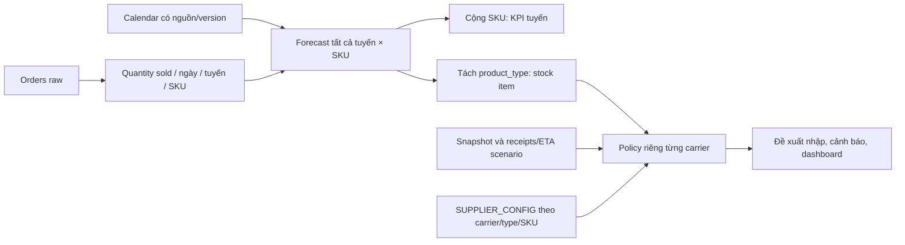

# Kiến trúc và chính sách tồn kho

Target hiện hành: **quantity success theo order_date UTC**. Forecast đủ **10 SKU × tuyến hợp lệ**; Top 10 chỉ để chấm KPI. Schema dưới đây là thiết kế **[MỀM]**, chưa phải hệ thống đã triển khai.

## 1. Input → xử lý → output



Country là nước sử dụng SIM; carrier là nhà mạng nước đích và chiều đối tác quản lý tồn. Region là chiều tổng hợp, không mặc nhiên là kho vật lý. Raw orders là nguồn được cấp; stock/config/receipts/EOL do nhóm dựng có source, lý do, status, version, scenario_id và seed nếu có.

## 2. Bảng và khóa

| Bảng logic | Khóa / nội dung chính |
|---|---|
| ORDERS | order_id; raw bất biến, order_date và activation_date suy ra UTC riêng; kiểm tra bộ ba carrier/country/region |
| REGION, COUNTRY, CARRIER | Mapping carrier → country → region; Country 1–n Carrier, Region 1–n Country |
| SKU_CATALOG | sku; plan_type/data_gb/validity_days; SKU chưa đủ xác định hàng thay thế |
| CUSTOMER | Tùy chọn tra cứu; không dùng tổng hợp toàn kỳ hoặc customer_type làm feature |
| CALENDAR | date; phủ ngày forecast, nguồn/version |
| DAILY_DEMAND | target_version + order_date + series_key; series_key = country/carrier/SKU; gộp type ở output cơ sở |
| FORECAST_RESULT | **run_id + series_key + forecast_date**; metadata gồm target/grain, model_version, origin, cutoff, UTC và filter success |
| REGION_INVENTORY | snapshot + stock_item_id; stock item giải ra country/carrier/SKU/product_type, region được đối soát; lưu usable/reserved/unsellable và provenance |
| SUPPLIER_CONFIG | config_id/version, carrier, product_type, scope SKU, effective_from/to, scenario_id; quy tắc default/override rõ |
| REORDER_RECOMMENDATION | recommendation_id + stock item; liên kết forecast run, snapshot, config/allocation/rule version, scenario và trạng thái |
| OPEN_RECEIPTS, bổ sung khi cần | receipt/order ID, stock item, quantity, ETA, trạng thái; hỗ trợ idempotency |

**[CỨNG]** run_date không đủ phân biệt rerun. Khuyến nghị dùng nhiều ngày forecast phải liên kết cả run/kỳ bảo vệ, không FK vào một dòng ngày. Không dùng chung một stock cho nhiều carrier/type. Tên REGION_INVENTORY giữ để đối chiếu thiết kế cũ, không xác nhận vị trí kho.

## 3. SUPPLIER_CONFIG riêng từng đối tác

Mentor đã xác nhận **ngưỡng tồn và quy tắc nhập khác nhau giữa carrier/đối tác**. Mỗi carrier phải có config riêng; không dùng một bộ tham số toàn hệ thống. Chưa có số ngưỡng cụ thể cho “Vina” hay đối tác khác.

| Nhóm cấu hình | Nội dung |
|---|---|
| Scope/hiệu lực | carrier, product_type, SKU override nếu có, effective_from/to, config_version, scenario_id |
| Policy | periodic review hoặc continuous (s,S); L, R, cơ sở tính IP |
| SS/ROP | Phương pháp/giá trị SS, cách tính hoặc manual ROP, mức S nếu dùng |
| Trigger/cảnh báo | Đại lượng so ngưỡng (usable on-hand/IP), ngưỡng riêng, toán tử < hoặc ≤, mức cảnh báo |
| Lượng nhập | MOQ; pack_multiple tách riêng; giới hạn sức chứa, hạn dùng, EOL nếu có |
| Truy vết | Source, lý do, status, người cấu hình và thời điểm cập nhật |

**[MỀM]** Ưu tiên override carrier/type/SKU → default cùng carrier/type. Không tự mượn cấu hình của carrier khác; không tìm được config thì `config_missing`. Các tham số có thể trùng nếu được khai báo chủ ý, không do fallback chung âm thầm.

Kiểm tra uniqueness và khoảng hiệu lực không chồng lấn trong cùng scope/scenario; dùng config đã biết tại origin. `sku='*'` không phải SKU thật để ép qua FK; có thể dùng scope + SKU nullable. Rule phải ghi rõ xử lý **stock đúng ngưỡng**. Nguyên tắc cấu hình riêng đã xác nhận; số ngưỡng, policy và thứ tự override đề xuất vẫn cần mentor xác nhận.

## 4. Phân bổ xuống stock item

Output cơ sở là tuyến × SKU, phân bổ tiếp product_type nếu chưa dự báo riêng. Nếu model chỉ dự báo tổng tuyến thì phân bổ xuống SKU/type để vẫn xuất đủ sản phẩm. Share dùng **quantity success/order_date UTC**, cùng parent và cửa sổ tại origin.

**[MỀM]** Có thể thử cửa sổ 30 ngày, fallback 90 ngày; chọn bằng validation và lưu allocation_version.

**[CỨNG]** Chỉ dùng lịch sử tới origin; lọc offering hợp lệ. Chưa có lịch sử khác không còn cung cấp; mẫu số mọi cửa sổ bằng 0 thì `allocation_unavailable` hoặc mapping scenario đã khai báo. Chỉ ép tổng share=1 khi toàn bộ lượng cha còn phục vụ được; EOL có phần giữ được/phần mất riêng. Không tự đổi country cùng region, eSIM sang physical_SIM hoặc successor không tương thích điểm đến/thiết bị/gói/nguồn cung.

Forecast giữ số thực; chỉ làm tròn lượng nhập. Nếu phân bổ số nguyên, quy tắc phần dư phải giữ tổng. Backtest cấp nhận phân bổ; quantile cha nhân share không tự là quantile đúng của con vì còn sai số share.

## 5. Policy, SS và lượng nhập

L là lead time mua hàng, R là chu kỳ review, cùng đơn vị ngày với forecast. **Activation lag không phải L.** IP = usable on-hand + receipts được công nhận − nghĩa vụ chưa đáp ứng; không trừ reservation hai lần hoặc trùng backorder.

**[MỀM] / [XÁC NHẬN]** Công thức tham khảo cho carrier chọn periodic review: mỗi R ngày đặt tới S bảo vệ L+R ngày.

```text
H = L + R
S = ceil(sum(forecast[1..H]) + SS_H)
q_raw = max(0, S - IP)
q = 0                         nếu q_raw = 0
q = max(MOQ, ceil(q_raw))      nếu q_raw > 0
```

Nếu có pack_multiple=m, q=m×ceil(max(MOQ,q_raw)/m) khi q_raw>0. Sau đó kiểm tra hạn dùng, sức chứa, EOL và xử lý xung đột. **MOQ không phải bội số đóng gói.**

Nếu carrier chọn continuous (s,S), dùng trigger so IP với s theo toán tử đã cấu hình rồi đặt lên S đã định nghĩa; s có thể tính bằng forecast trong L + SS_L hoặc manual ROP có nguồn. Không trộn trigger/target giữa hai policy. ROP+forecast_7d không tự là đếm đôi, phải xét kỳ bảo vệ.

**SS đề xuất:** heuristic velocity×safety_stock_days hoặc residual cộng dồn đúng horizon từ backtest không leakage:
`SS_H=max(0, quantile_alpha(actual_H−forecast_H))`.
Phương pháp/alpha/số ngày SS cấu hình riêng theo carrier; heuristic không chứng minh đạt service level. Không cộng quantile ngày thành quantile tổng. Công thức z×sigma×sqrt(L) chỉ là đối chứng dưới giả định thích hợp; cycle service level khác fill rate.

## 6. Projected stock và cảnh báo

Khai báo giả định tiêu thụ theo quantity bán ngày order. Mỗi ngày mô phỏng theo thứ tự nhận–tiêu thụ đã chọn, xét ETA, reservation/backorder và bảo toàn tồn kho.

- **[CỨNG]** Thiếu stock/config/ETA không coi là 0 hoặc hàng sẵn có. IP cao vẫn có thể thiếu trước ETA; tách lượng đặt khỏi rủi ro này.
- velocity_7d=0 không suy ra OK hoặc SS/ROP bằng 0 là an toàn; dùng forecast cộng dồn/fallback, thiếu bằng chứng ghi “chưa đủ dữ liệu”. days_of_cover=N/A.
- Ngày cạn chỉ trong horizon đầy đủ; nếu chưa cạn ghi “chưa thấy cạn trong horizon”. Ngoại suy có nhãn. Phân biệt hết tồn cuối ngày và thiếu nhu cầu trong ngày.
- Giữ KPI cảnh báo trước ≥7 ngày và kiểm chứng. **[MỀM]** H≥max(L+R,14) là thử nghiệm cần xác nhận/backtest, không bảo đảm KPI.
- Receipt/khuyến nghị có trạng thái/idempotency; rerun không tạo đề xuất lặp cho đơn đã chấp nhận.

## 7. EOL

Lifecycle thuộc offering/stock item, không dừng toàn bộ SKU vì một carrier ngừng. Lưu scope, source, người cấu hình, thời điểm xác nhận scenario và ngày cuối nhập/bán/kích hoạt/dịch vụ. Activation vẫn có thể phục vụ kiểm tra quyền sử dụng sau bán, không trở thành target.

Chỉ mask đoạn không còn chào bán theo effective date, giữ history. Successor không self-loop/vòng, phải active và tương thích country/thiết bị/gói/nguồn cung. Zero-run/lỗi chỉ là tín hiệu nghi gián đoạn. Hệ số chuyển đổi/cold-start là scenario, không gọi là đã học.

Demo gồm dừng có báo trước, dừng đột ngột không successor, suspended rồi hồi phục; có nhánh thông báo muộn/hủy thông báo. Luật EOL đầy đủ và ca kiểm thử tại [AGENTS](../AGENTS.md); đánh giá mô phỏng tại [EVALUATION_AND_BACKTEST](EVALUATION_AND_BACKTEST.md).
